==================
Hikari + Lightbulb
==================
Get Started Guide, by Nova

Introduction
============

| I hightly recommand an **intermediate level** of Python knowledge before you begin this guide.
| If you don't know Python well, Carberra Tutorials is a good place to get started: https://www.youtube.com/playlist?list=PLYeOw6sTSy6bHRFwzIA3VAy05J2tJAAoS

Throughout this guide you will see links like "`Read the docs <#>`_" which go to the
`Hikari docs <https://www.hikari-py.dev/hikari/>`_, `Lightbulb docs <https://hikari-lightbulb.readthedocs.io/en/latest/>`_
or other documentation.
I try to put them in useful places where people might need them to modify their code to suit a different purpose.

| The GitHub Repository for this guide is located `here <https://github.com/novanai/hikari-lightbulb-guide>`_
| This should really only be used as an assist to the guide, and *not to just copy and paste*. :<

This guide was last updated on ``17 August 2022``.

What does this guide cover?
---------------------------

- Commands & command options (text-based prefix & slash)
- Lightbulb extensions & plugins
- Message components (specifically select menus)
- Command checks & cooldowns 
- Basic error handling

.. _Part 1:

Making your Discord Bot Application
===================================

`Carberra Tutorials <https://www.youtube.com/channel/UC13cYu7lec-oOcqQf5L-brg>`_ made a video on
`Creating a bot on the Developer Portal <https://www.youtube.com/watch?v=jSGPNChqGAY?t=76>`_ which you can follow to do this:

.. raw:: html

    <iframe width="560" height="315" src="https://www.youtube-nocookie.com/embed/jSGPNChqGAY?start=76"
        title="YouTube video player" frameborder="0" allow="accelerometer; autoplay; clipboard-write;
        encrypted-media; gyroscope; picture-in-picture" allowfullscreen>
    </iframe>

Setting up the files
====================

Make a folder for your bot:

.. code-block:: bash

    mkdir my_bot
    cd my_bot

Then, make 3 files:

* ``bot.py``
* ``requirements.txt``
* ``.env``

After all that, your file structure should look like this:

.. code-block:: 

    my_bot
    │ bot.py
    │ requirements.txt
    │ .env

Make a virtual environment
==========================
This is optional, but recommended.

Windows:

.. code-block:: bash

    python -m venv .venv
    .\.venv\Scripts\activate

Linux:

.. code-block:: bash

    python -m venv .venv
    source .venv/bin/activate

You'll need to activate this venv when running your bot.

Read more about virtual environments here: https://docs.python.org/3/tutorial/venv.html.

Installing requirements
=======================

In ``requirements.txt`` paste the following

.. code-block::

    hikari[speedups]>=2.0.0.dev110
    hikari-lightbulb>=2.2.4
    hikari-miru>=1.1.2
    python-dotenv>=0.20.0

And then run

.. code-block:: bash

    python -m pip install -r requirements.txt

What have we just installed?
----------------------------

- `Hikari <https://www.hikari-py.dev/hikari/>`_ - a "sane Python framework for writing modern Discord bots"
- `Lightbulb <https://hikari-lightbulb.readthedocs.io/en/latest>`_ - a "simple and easy to use command framework for Hikari"
- `Miru <https://hikari-miru.readthedocs.io/en/latest/index.html>`_ - an "optional component handler for Hikari"

So now, let's begin!

Part 1 - Hikari Bot
===================

First, grab your bot's token from the `Discord Developer Portal <https://discord.com/developers/applications>`_
(refer to :ref:`Making your Discord Bot Application<Part 1>`) and put it in the ``.env`` file, like so:

.. code-block:: bash

    BOT_TOKEN=your_bot_token

Next, in ``bot.py`` paste the following:

.. code-block:: python
    :linenos:

    import asyncio
    import os

    import dotenv
    import hikari

    dotenv.load_dotenv()

    bot = hikari.GatewayBot(
        os.environ["BOT_TOKEN"],
        intents=hikari.Intents.ALL,
    )

    @bot.listen()
    async def on_message_create(event: hikari.GuildMessageCreateEvent) -> None:
        if not event.is_human or not event.content:
            return

        if event.content.strip() == "+ping":
            await event.message.respond(
                f"Pong! Latency: {bot.heartbeat_latency*1000:.2f}ms"
            )

    if __name__ == "__main__":
        if os.name == "nt":
            # we are running on a Windows machine, and we have to add this so
            # the code doesn't error :< (it most likely will error without this)
            asyncio.set_event_loop_policy(asyncio.WindowsSelectorEventLoopPolicy())

        bot.run()

Now save ``bot.py`` and run it:

.. code-block:: bash

    python bot.py

You should see an output similar to this:

.. _Hikari Output:

.. code-block::

    oooo         o8o  oooo                            o8o       光 2.0.0.dev110 [47bf3fcb]
    `888         `"'  `888                            `"'       © 2021-present davfsa - MIT license
     888 .oo.   oooo   888  oooo   .oooo.   oooo d8b oooo       interpreter:   CPython 3.10.5
     888P"Y88b  `888   888 .8P'   `P  )88b  `888""8P `888       running on:    AMD64 Windows 10
     888   888   888   888888.     .oP"888   888      888       installed at:  C:\Users\Nova\Documents\my_bot\.venv\lib\site-packages\hikari
     888   888   888   888 `88b.  d8(  888   888      888       documentation: https://hikari-py.dev/hikari
    o888o o888o o888o o888o o888o `Y888""8o d888b    o888o      support:       https://discord.gg/Jx4cNGG

    I 2022-08-13 16:38:07,798 hikari.bot: you can start 999 sessions before the next window which starts at 2022-08-13 17:38:11.748231+00:00; planning to start 1 session...
    I 2022-08-13 16:38:08,282 hikari.gateway.0: shard is ready: 1 guilds, Hikari#1093 (1007678609466601492), session '1868778c46c81d612853915354a51f37' on v8 gateway
    I 2022-08-13 16:38:08,291 hikari.bot: started successfully in approx 0.79 seconds

Now go into the server you invited your bot to, and send ``+ping``.

The bot should respond with ``Pong!`` and it's heartbeat latency:

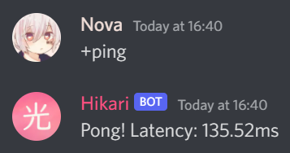

**Congratulations, you've just run your first Hikari bot!**

Now let's go through what everything does

- **Line 1-5** - Import the ``asyncio``, ``os``, ``dotenv`` and ``hikari`` modules
- **Line 7** - Load the ``.env`` file
- | **Line 9-12** - Create a bot using that token, and all Discord `intents <https://discord.com/developers/docs/topics/gateway#gateway-intents>`_
  | `Read the docs - Intents <https://hikari-lightbulb.readthedocs.io/en/latest/hikari_basics/intents.html>`_
- **Line 15-23** - The bot listens for messages sent in guilds (servers)
    - If the message author is not a human or the message has no text content (though it may have attachments), it ignores it
    - Otherwise, it checks if the message content is ``+ping`` and if it is, the bot responds with ``Pong!`` and it's heartbeat latency
- **Line 26-32**
    - If we are on a Windows machine, we have to add line 30 to stop a possible asyncio error from occuring
    - And finally, run the bot!

This bot works, but to add more commands other than ``+ping`` would be a *huge* hassle, so this is where Lightbulb comes in...

Part 2 - Lightbulb Bot
======================

Lightbulb is a command handler for Hikari, making it easy to create commands.

So to start using Lightbulb, let's change our ``bot.py`` a little (new code has been highlighted): 

.. code-block:: python
    :linenos:
    :emphasize-lines: 6, 10-15, 18-22

    import asyncio
    import os

    import dotenv
    import hikari
    import lightbulb

    dotenv.load_dotenv()

    bot = lightbulb.BotApp(
        os.environ["BOT_TOKEN"],
        intents=hikari.Intents.ALL,
        prefix="+",
        banner=None,
    )

    @bot.command
    @lightbulb.command("ping", description="The bot's ping")
    @lightbulb.implements(lightbulb.PrefixCommand, lightbulb.SlashCommand)
    async def ping(ctx: lightbulb.Context) -> None:
        await ctx.respond(f"Pong! Latency: {bot.heartbeat_latency*1000:.2f}ms")

    if __name__ == "__main__":
        if os.name == "nt":
            asyncio.set_event_loop_policy(asyncio.WindowsSelectorEventLoopPolicy())

        bot.run()

- **Line 6** - We've imported lightbulb now too
- **Line 10-15** - We've used lightbulb to create the bot, adding
    - a ``prefix`` kwarg set to ``"+"``, for text-based commands
    - | a ``banner`` kwarg set to ``None``, disabling the hikari banner that appears when the bot starts
      | This isn't necessary, but the banner can get a little annoying after a while (sorry dav >_>)
- **Line 18-22** - Creates a command with the lightbulb bot named ``ping`` which works the same as the old ``ping`` command, responding with ``Pong!`` and the bot's heartbeat latency

Now let's run the bot again!

You should see a slightly different output this time:

.. code-block::

    I 2022-08-13 16:40:23,476 hikari.bot: you can start 998 sessions before the next window which starts at 2022-08-13 17:23:11.910600+01:00; planning to start 1 session...
    I 2022-08-13 16:40:24,051 hikari.gateway.0: shard is ready: 1 guilds, Hikari#1093 (1007678609466601492), session '9c0a984004cdf4ed7d52ee1343f44121' on v8 gateway
    I 2022-08-13 16:40:24,368 lightbulb.internal: Processing guild application commands
    I 2022-08-13 16:40:24,973 lightbulb.internal: Processing application commands for guild 765236394577756171
    I 2022-08-13 16:40:25,250 lightbulb.internal: Processing global application commands
    I 2022-08-13 16:40:25,517 lightbulb.internal: Application command processing completed
    I 2022-08-13 16:40:25,520 hikari.bot: started successfully in approx 2.35 seconds

Again, if you run the command ``+ping`` in your server, the bot should respond with it's heartbeat latency.

Now, try typing ``/ping`` in Discord. A command should appear, with your bot's avatar next to it:

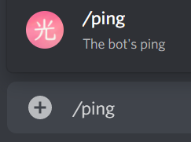

Hit enter, and let's run this new command!

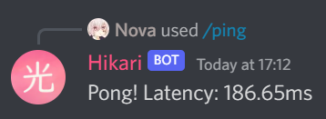

We've just made a slash command! By passing ``lightbulb.SlashCommand`` to the ``@lightbulb.implements`` decorator, lightbulb
will turn the command into a slash command, as well as a text-based prefix command (``lightbulb.PrefixCommand``).

.. note::

    If you wanted to make your commands slash-only, you can remove the prefix kwarg on line 14 and
    ``lightbulb.PrefixCommand`` from the implements decorator.

Command Options
---------------

| Commands, both prefix and slash, can have options. Discord supports quite a few
 `options types <https://discord.com/developers/docs/interactions/application-commands#application-command-object-application-command-option-type>`_
 for slash commands.
| `Read the docs - Command Option Types <https://hikari-lightbulb.readthedocs.io/en/latest/guides/commands.html#converters-and-slash-command-option-types>`_

Let's make a new command using some of these option types to demonstrate them!

After your ``ping`` command, add this:

.. code-block:: python
    :linenos:

    @bot.command
    @lightbulb.option("ping", "Role to ping with announcement.", type=hikari.Role)
    @lightbulb.option(
        "channel", "Channel to post announcement to.", type=hikari.TextableChannel
    )
    @lightbulb.option("image", "Announcement attachment.", type=hikari.Attachment)
    @lightbulb.option("message", "The message to announce.", type=str)
    @lightbulb.command("announce", "Make an announcement!", pass_options=True)
    @lightbulb.implements(lightbulb.PrefixCommand, lightbulb.SlashCommand)
    async def announce(
        ctx: lightbulb.Context,
        message: str,
        image: hikari.Attachment,
        channel: hikari.InteractionChannel,
        ping: hikari.Role,
    ) -> None:
        embed = hikari.Embed(
            title="Announcement!",
            description=message,
        )
        embed.set_image(image)

        await ctx.bot.rest.create_message(
            content=ping.mention,
            channel=channel.id,
            embed=embed,
            role_mentions=True,
        )

        await ctx.respond(
            f"Announcement posted to <#{channel.id}>!", flags=hikari.MessageFlag.EPHEMERAL
        )

- **Line 2-8** - Specifying the options for our command
    - You can see that we've specified a type for each option, such as ``hikari.Role``, ``hikari.TextableChannel`` and ``hikari.Attachment``
    - Using built-in Python types such as ``str`` and ``int`` is also valid (**Line 7**)    
- **Line 12-15** - We've passed our options as parameters to the command's function
    - **NOTE:** The parameters must be named exactly as the options
    - | You **cannot**, for example, call your ``message`` parameter ``msg``
      | Lightbulb will error if you do so
- | **Line 17-21** - Create an embed, setting its description to the message our author gave, and the image to the image they chose too
  | We'll go into more detail on creating embeds in the next part (:ref:`Making a lightbulb extension<Part 3>`)
- **Line 23-28** - Send the message to the give channel, pinging the role given in the command options
    - **NOTE:** To ping everyone with the role, you must have set ``role_mentions`` to ``True``, and the bot must have the ``Mention All Roles`` permission in the guild
- **Line 30-32** - Respond to the interaction with an ``ephemeral`` message, stating where the announcement has been posted

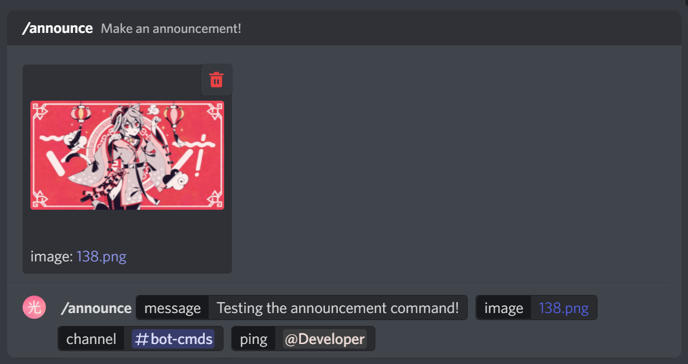
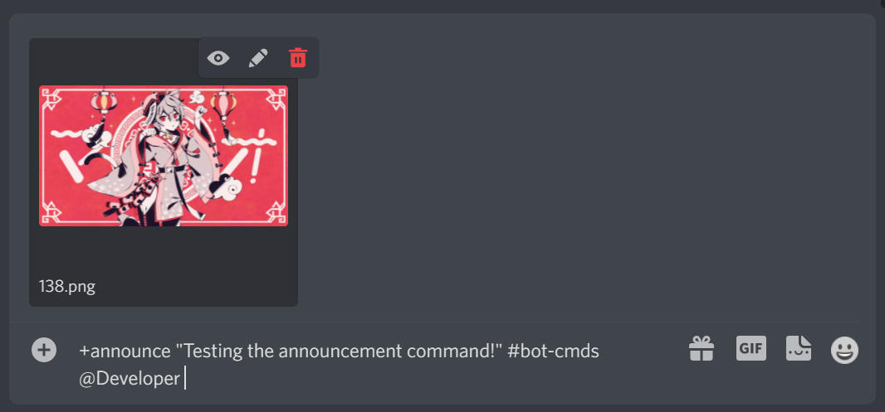
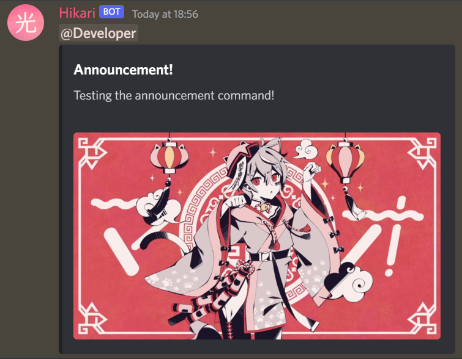
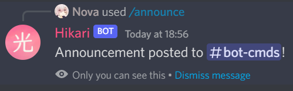

`Read the docs - Commands <https://hikari-lightbulb.readthedocs.io/en/latest/guides/commands.html>`_

.. _Part 3:

Part 3 - Making a lightbulb extension
=====================================

Extensions are a useful way of separating parts of your bot into different files, making it easier to manage.

So, let's create an extension!

In your ``my_bot`` folder make a new folder named ``extensions``.

Then in that folder create a file named ``info.py``.

Your file structure should look like this now:

.. code-block::

    my_bot
    │ bot.py
    │ requirements.txt
    │ .env
    │
    └── extensions
    │ │ info.py

In ``info.py`` paste the following:

.. code-block:: python
    :linenos:

    from datetime import datetime
    from typing import Optional

    import hikari
    import lightbulb

    info_plugin = lightbulb.Plugin("Info")

    @info_plugin.command
    @lightbulb.option(
        "user", "The user to get information about.", hikari.User, required=False
    )
    @lightbulb.command("userinfo", "Get info on a server member.", pass_options=True)
    @lightbulb.implements(lightbulb.PrefixCommand, lightbulb.SlashCommand)
    async def userinfo(ctx: lightbulb.Context, user: Optional[hikari.User] = None) -> None:
        if not (guild := ctx.get_guild()):
            await ctx.respond("This command may only be used in servers.")
            return

        user = user or ctx.author
        user = ctx.bot.cache.get_member(guild, user)

        if not user:
            await ctx.respond("That user is not in the server.")
            return

        created_at = int(user.created_at.timestamp())
        joined_at = int(user.joined_at.timestamp())

        roles = (await user.fetch_roles())[1:]  # All but @everyone
        roles = sorted(
            roles, key=lambda role: role.position, reverse=True
        )  # sort them by position, then reverse the order to go from top role down

        embed = (
            hikari.Embed(
                title=f"User Info - {user.display_name}",
                description=f"ID: `{user.id}`",
                colour=0x3B9DFF,
                timestamp=datetime.now().astimezone(),
            )
            .set_footer(
                text=f"Requested by {ctx.author.username}",
                icon=ctx.author.display_avatar_url,
            )
            .set_thumbnail(user.avatar_url)
            .add_field(
                "Bot?",
                "Yes" if user.is_bot else "No",
                inline=True,
            )
            .add_field(
                "Created account on",
                f"<t:{created_at}:d>\n(<t:{created_at}:R>)",
                inline=True,
            )
            .add_field(
                "Joined server on",
                f"<t:{joined_at}:d>\n(<t:{joined_at}:R>)",
                inline=True,
            )
            .add_field(
                "Roles",
                ", ".join(r.mention for r in roles),
                inline=False,
            )
        )

        await ctx.respond(embed)

    def load(bot: lightbulb.BotApp) -> None:
        bot.add_plugin(info_plugin)

And in ``bot.py`` we'll need to make a little change. On line 17, add:

.. code-block:: python

    bot.load_extensions_from("./extensions/")

So, now let's run the bot with our new ``userinfo`` command!

You should see a new line in your output:

.. code-block::

    I 2022-08-13 17:22:03,151 lightbulb.app: Extension loaded 'extensions.info'

Now let's go and try out the command:

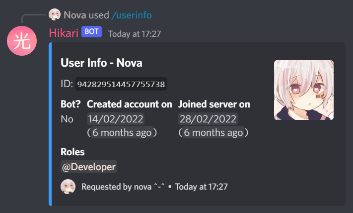

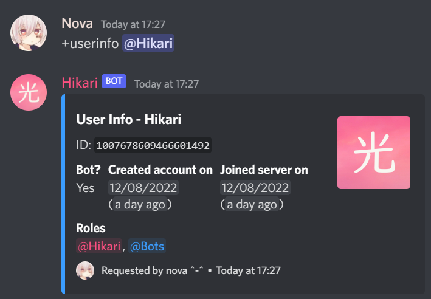

Now to go through what everything does...

- | **Line 7** - Create a plugin named ``Info``, which will be used to add our new command
  | `Read the docs - Creating plugins <https://hikari-lightbulb.readthedocs.io/en/latest/guides/plugins.html>`_
- **Line 10** - Decorator to attach the following command to the plugin
- | **Line 11-13** - Add a command option named "``user``" with a type of ``hikari.User`` that is **not required**
                     and a description of "``The user to get information about.``"
  | `Read the docs - Converters and Slash Command Options Types <https://hikari-lightbulb.readthedocs.io/en/latest/guides/commands.html#converters-and-slash-command-option-types>`_
- **Line 14** - Decorator to create the command, setting the name to "``userinfo``" and the description to "``Get info on a server member.``"
- **Line 15** - Converts the decorated function into a prefix command and slash command
- | **Line 16** - The command's function, which takes the parameters ``ctx`` and ``user``
  | `Read the docs - lightbulb.Context <https://hikari-lightbulb.readthedocs.io/en/latest/api_references/context.html>`_
  | `Read the docs - hikari.User <https://www.hikari-py.dev/hikari/users.html#hikari.users.User>`_
- | **Line 17** - Get the guild (``ctx.get_guild()``)
  | `Read the docs - Python Walrus Operator (:=) <https://realpython.com/python-walrus-operator/>`_
- | **Line 21-22** - If a user was not passed as an option (``user`` will be ``None``), we assign ``ctx.author`` to ``user``
  | Then, get the member of the guild
  | **Note:** This will return ``None`` if the target is not found in the guild
- | **Line 28-29** - Get the `UNIX Timestamps <https://www.unixtimestamp.com/>`_ for when the member created their account and joined the guild
  | **Note:** The rounding with ``int()`` is necessary, as Discord timestamps only work with integers, not floats
- **Line 31-34** - Get the member's list of roles, excluding ``@everyone``, then sort them from highest role to lowest
- **Line 37-42** - Make a Discord `embed <https://www.hikari-py.dev/hikari/embeds.html#hikari.embeds.Embed>`_ setting the title, description, colour and timestamp
- **Line 43-47** - Set the embed's `footer <https://www.hikari-py.dev/hikari/embeds.html#hikari.embeds.Embed.set_footer>`_ and `thumbnail <https://www.hikari-py.dev/hikari/embeds.html#hikari.embeds.Embed.set_footer>`_
- **Line 48-67** - Add `fields <https://www.hikari-py.dev/hikari/embeds.html#hikari.embeds.Embed.add_field>`_ to the embed, stating
    - whether the user is a bot or not
    - when their account was created & when they joined the server, using `Discord Timestamps <https://discord.com/developers/docs/reference#message-formatting-timestamp-styles>`_
    - a list of roles the member has
- **Line 70** - respond to the interaction with the embed (`Read the docs - Context.respond <https://hikari-lightbulb.readthedocs.io/en/latest/api_references/context.html#lightbulb.context.base.ApplicationContext.respond>`_)
- | **Line 73-74** - the load function, to load the extension when the bot starts
  | **Note:** This is required in each extension

`Read the docs - Extensions <https://hikari-lightbulb.readthedocs.io/en/latest/guides/extensions.html>`_

Part 4 - BotApp.d - a built-in DataStore
========================================

This is a small bit preparation for the next section (Command Groups & Subcommands).

In our ``bot.py`` file, we'll need to add some "listeners".

Just above ``import dotenv`` add:

.. code-block:: python

    import aiohttp

Then, just after ``bot.load_extensions_from("./extensions/")``, add:

.. code-block:: python
    :linenos:

    @bot.listen()
    async def on_starting(event: hikari.StartingEvent) -> None:
        bot.d.aio_session = aiohttp.ClientSession()

    @bot.listen()
    async def on_stopping(event: hikari.StoppingEvent) -> None:
        await bot.d.aio_session.close()

- This creates 2 event listeners, one for when the bot is starting, and one for when the bot is stopping
- When the bot is starting, it creates a new ``aiohttp.ClientSession`` named ``aio_session`` and stores it in the ``bot.d`` data store
- When the bot is stopping, it closes the ``aio_session`` client session

`Read the docs - aiohttp <https://docs.aiohttp.org/en/stable/>`_

Part 5 - Command Groups & Subcommands
=====================================

Create a new file named ``fun.py`` in the extensions folder - this will contain our bot's second extension.

In ``fun.py`` paste the following:

.. code-block:: python
    :linenos:

    import hikari
    import lightbulb

    fun_plugin = lightbulb.Plugin("Fun")

    @fun_plugin.command
    @lightbulb.command("fun", "All the entertainment commands you'll ever need!")
    @lightbulb.implements(lightbulb.PrefixCommandGroup, lightbulb.SlashCommandGroup)
    async def fun_group(ctx: lightbulb.Context) -> None:
        pass  # as slash commands cannot have their top-level command ran, we simply pass here

    @fun_group.child
    @lightbulb.command("meme", "Get a meme!")
    @lightbulb.implements(lightbulb.PrefixSubCommand, lightbulb.SlashSubCommand)
    async def meme_subcommand(ctx: lightbulb.Context) -> None:
        async with ctx.bot.d.aio_session.get(
            "https://meme-api.herokuapp.com/gimme"
        ) as response:
            res = await response.json()
            if response.ok and res["nsfw"] != True:
                link = res["postLink"]
                title = res["title"]
                img_url = res["url"]

                embed = hikari.Embed(colour=0x3B9DFF)
                embed.set_author(name=title, url=link)
                embed.set_image(img_url)

                await ctx.respond(embed)

            else:
                await ctx.respond(
                    "Could not fetch a meme :c", flags=hikari.MessageFlag.EPHEMERAL
                )

    def load(bot: lightbulb.BotApp) -> None:
        bot.add_plugin(fun_plugin)

- **Line 4** - Create a new plugin named ``Fun``
- **Line 7** - Decorator to attach the following command to the plugin
- **Line 8** - Decorator to create the command, setting the name to "``fun``" and adding a description
- **Line 9** - Converts the decorated function to a PrefixCommandGroup and SlashCommandGroup
- **Line 10** - The command's function
- **Line 11** - pass the function, as slash commands cannot have their top-level command ran
- **Line 14** - attach the decorated function to the ``fun_group`` command
- **Line 15** - Decorator to create the subcommand, setting the name to ``meme`` and adding a description
- **Line 16** - Converts the decorated function to a ``PrefixSubCommand`` and ``SlashSubCommand``
- **Line 17** - The subcommand's function
- | **Line 18-21** - Using the ``aio_session`` from the ``bot.d`` data store that we created in the previous section, get a meme from the API
  | `Read the docs - aiohttp.ClientSession <https://docs.aiohttp.org/en/stable/#client-example>`_
- **Line 22** - If the response is successful and the meme is not NSFW (Not Safe For Work), then
    - **Line 23-25** - Get the meme's link, title and image url
    - **Line 27** - Create an embed
    - **Line 28** - Set the embed's author to the meme's title and link
    - **Line 29** - Set the embed's image to the meme's image url
    - **Line 31** - Respond to the interaction with the embed
- **Line 33** - Otherwise, if the response was not successful or the meme was NSFW, then
    - **Line 34-36** - Respond to the interaction with an ephemeral message, stating that we could not fetch a meme

Now, let's test it!

.. image:: ../_static/meme_1.png

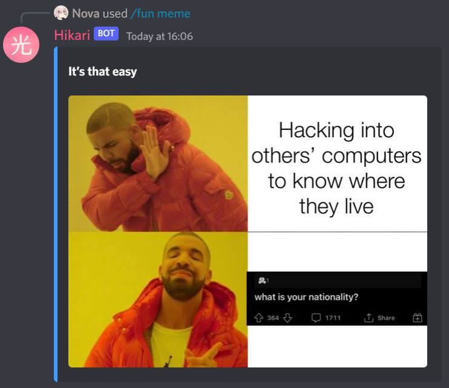

and if we can't fetch a meme:

.. note::

    Ephemeral response only work with application commands, not prefix commands

Part 6 - Message Components
====================================

Message components are a relatively new feature on Discord, allowing you to attach buttons and select menus to messages!

Let's add some new code to ``fun.py``.

At the very top of the file, import asyncio:

.. code-block:: python

    import asyncio

Then, insert the following after the ``meme`` command, but above the ``load`` function:

.. code-block:: python
    :linenos:

    ANIMALS = {
        "Dog": "🐶",
        "Cat": "🐱",
        "Panda": "🐼",
        "Fox": "🦊",
        "Red Panda": "🐼",
        "Koala": "🐨",
        "Bird": "🐦",
        "Racoon": "🦝",
        "Kangaroo": "🦘",
    }

    @fun_group.child
    @lightbulb.command("animal", "Get a fact + picture of a cute animal :3")
    @lightbulb.implements(lightbulb.PrefixSubCommand, lightbulb.SlashSubCommand)
    async def animal_subcommand(ctx: lightbulb.Context) -> None:
        select_menu = (
            ctx.bot.rest.build_action_row()
            .add_select_menu("animal_select")
            .set_placeholder("Pick an animal")
        )

        for name, emoji in ANIMALS.items():
            select_menu.add_option(
                name,  # the label, which users see
                name.lower().replace(" ", "_"),  # the value, which is used by us later
            ).set_emoji(emoji).add_to_menu()

        resp = await ctx.respond(
            "Pick an animal from the dropdown :3",
            component=select_menu.add_to_container(),
        )
        msg = await resp.message()

        try:
            event = await ctx.bot.wait_for(
                hikari.InteractionCreateEvent,
                timeout=60,
                predicate=lambda e: isinstance(e.interaction, hikari.ComponentInteraction)
                and e.interaction.user.id == ctx.author.id
                and e.interaction.message.id == msg.id
                and e.interaction.component_type == hikari.ComponentType.SELECT_MENU,
            )
        except asyncio.TimeoutError:
            await msg.edit("The menu timed out :c", components=[])
        else:
            animal = event.interaction.values[0]
            async with ctx.bot.d.aio_session.get(
                f"https://some-random-api.ml/animal/{animal}"
            ) as res:
                if res.ok:
                    res = await res.json()
                    embed = hikari.Embed(description=res["fact"], colour=0x3B9DFF)
                    embed.set_image(res["image"])

                    animal = animal.replace("_", " ")

                    await msg.edit(
                        f"Here's a {animal} for you! :3", embed=embed, components=[]
                    )
                else:
                    await msg.edit(f"API returned a {res.status} status :c", components=[])

- **Line 1-11** - Create a `dict <https://docs.python.org/3/tutorial/datastructures.html#dictionaries>`_ containing all the possible endpoints of `some-random-api.ml/animal/ <https://some-random-api.ml/endpoints>`_
- **Line 14-16** - Set up prefix and slash subcommands
- **Line 18-22**
    - Create an `action row <https://www.hikari-py.dev/hikari/api/rest.html#hikari.api.rest.RESTClient.build_action_row>`_, which returns an `ActionRowBuilder <https://www.hikari-py.dev/hikari/api/special_endpoints.html#hikari.api.special_endpoints.ActionRowBuilder>`_
    - Add a select menu to the action row, with "``animal_select``" as the custom ID 
    - Set the placeholder (the text that is seen when no option has been picked) to ``Pick an animal``
- **Line 24-28** - For all the items in the ``ANIMALS`` dict, add an option to the select menu (`Read the docs - SelectMenuBuilder.add_option <https://www.hikari-py.dev/hikari/api/special_endpoints.html#hikari.api.special_endpoints.SelectMenuBuilder.add_option>`_) with
    - The name
    - The value, which is the name of the animal but lowercased and with spaces replaced with underscores
    - Setting the emoji to the value of the animal in the ``ANIMALS`` dict
- **Line 30-34**
    - Respond to the context with the select menu
    - Fetch the message from the response (`Read the docs - ResponseProxy <https://hikari-lightbulb.readthedocs.io/en/latest/api_references/context.html#lightbulb.context.base.ResponseProxy>`_)
- **Line 36-44** - Wait for an interaction to be created and
    - Check if the interaction is a component interaction
    - Check that the interaction user is the same who ran the command
    - Check that the interaction message is the same as the message we sent
    - Check that the interaction component type is a select menu
- **Line 45-46** - If the interaction times out, an ``asyncio.TimeoutError`` will be raised, and so we can use that to handle the timeout by editing the message and removing the components
- **Line 48** - Get the value of the interaction (the selected option) - `Read the docs - ComponentInteraction.values <https://www.hikari-py.dev/hikari/interactions/component_interactions.html#hikari.interactions.component_interactions.ComponentInteraction.values>`_
- **Line 49-51** - Make a ``GET`` request to `some-random-api.ml <https://some-random-api.ml/>`_ with the selected animal as the option
- **Line 52** - If the response has an ``ok`` status, then
    - **Line 53** - Get the response's json
    - **Line 54** - Create an embed, setting its title to the animal fact
    - **Line 55** - Set the embed's image to the animal image
    - **Line 57** - Replace the underscore in animal with a space
    - **Line 59-61** - Edit the message to contain the embed, and remove the select menu component
- **Line 62** - Otherwise, if the response was not successful, then
    - **Line 63** - Edit the message to say what status code the API responded with, and remove the select menu component

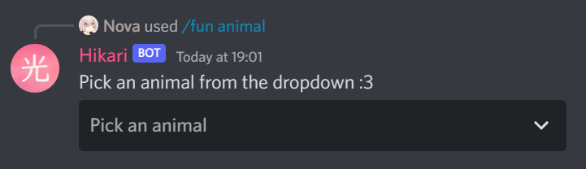

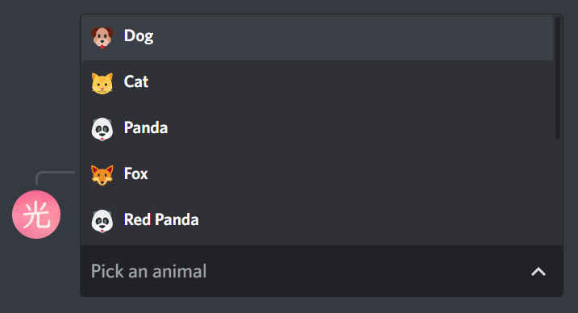

And if the menu times out:

`Read the docs - Components <https://hikari-lightbulb.readthedocs.io/en/latest/hikari_basics/components.html>`_

Part 7 - Miru, an optional component handler
============================================

`Miru <https://hikari-miru.readthedocs.io/en/latest/index.html>`_ is an optional component handler for hikari, making it *much*
simpler to add components to messages, and to handle component interactions too.

We'll need to edit ``bot.py`` a little bit to get miru working.

At the top of the file, import miru:

.. code-block:: python

    import miru

And just above ``bot.load_extensions_from("./extensions/")`` add:

.. code-block:: python

    miru.load(bot)

Now we need to edit ``fun.py``.

At the top of the file, import miru:

.. code-block:: python

    import miru

And now beneath our ``animal`` command, add the following:

.. code-block:: python
    :linenos:

    class AnimalView(miru.View):
        def __init__(self, author: hikari.User) -> None:
            self.author = author
            super().__init__(timeout=60)

        @miru.select(
            custom_id="animal_select",
            placeholder="Pick an animal",
            options=[
                miru.SelectOption("Dog", "dog", emoji="🐶"),
                miru.SelectOption("Cat", "cat", emoji="🐱"),
                miru.SelectOption("Panda", "panda", emoji="🐼"),
                miru.SelectOption("Fox", "fox", emoji="🦊"),
                miru.SelectOption("Red Panda", "red_panda", emoji="🐼"),
                miru.SelectOption("Koala", "koala", emoji="🐨"),
                miru.SelectOption("Bird", "bird", emoji="🐦"),
                miru.SelectOption("Racoon", "racoon", emoji="🦝"),
                miru.SelectOption("Kangaroo", "kangaroo", emoji="🦘"),
            ],
        )
        async def select_menu(self, select: miru.Select, ctx: miru.Context) -> None:
            animal = select.values[0]
            async with ctx.app.d.aio_session.get(
                f"https://some-random-api.ml/animal/{animal}"
            ) as res:
                if res.ok:
                    res = await res.json()
                    embed = hikari.Embed(description=res["fact"], colour=0x3B9DFF)
                    embed.set_image(res["image"])

                    animal = animal.replace("_", " ")

                    await ctx.edit_response(
                        f"Here's a {animal} for you! :3", embed=embed, components=[]
                    )
                else:
                    await ctx.edit_response(
                        f"API returned a {res.status} status :c", components=[]
                    )

        async def on_timeout(self) -> None:
            await self.message.edit("The menu timed out :c", components=[])

        async def view_check(self, ctx: miru.Context) -> bool:
            return ctx.user.id == self.author.id

    @fun_group.child
    @lightbulb.command("animal2", "Get a fact + picture of a cute animal :3")
    @lightbulb.implements(lightbulb.PrefixCommand, lightbulb.SlashSubCommand)
    async def animal_subcommand_2(ctx: lightbulb.Context) -> None:
        view = AnimalView(ctx.author)
        resp = await ctx.respond(
            "Pick an animal from the dropdown :3", components=view.build()
        )
        msg = await resp.message()

        view.start(msg)
        await view.wait()

This new ``animal2`` command produces the exact same result as the first ``animal`` command, but it's much easier to read
and understand at a glance, and adding buttons or other select menus would be incredibly easy.

- **Line 1** - Subclass ``miru.View``, to create our custom ``AnimalView`` class
- **Line 4** - Initialise our view with a timeout of 60 seconds
- **Line 6-20** - Create our `select menu <https://hikari-miru.readthedocs.io/en/latest/api_references/select.html>`_, with the same custom ID, placeholder and options as before
- **Line 22-39** - Perform the same request as before, and respond to the interaction with an embed
- | **Line 41-45** - Set our timeout function, and a view check
  | `Read the docs - View Checks & Timeout Handling <https://hikari-miru.readthedocs.io/en/latest/guides/checks_timeout.html>`_
- **Line 48-50** - Create a second animal command, called "``animal2``" 
- **Line 52** - Create an instance of ``AnimalView``
- **Line 53-55** - Respond to the command interaction with our message and components
- **Line 58** - Start the view
- **Line 59** - Wait for the view to finish

.. note::

    If you want to learn how to use buttons and more with Miru, check out the Miru guides, written by Miru's creator:
    https://hikari-miru.readthedocs.io/en/latest/getting-started.html

Part 8 - Command Checks
=======================

For this section, we'll be making a ``purge`` command, which will delete messages in bulk.
You don't want *anyone* to be able to use this command, only those who can delete messages themselves,
so we're gonna need to add some command checks to ensure that!

So, create a new file named ``mod.py`` in the extensions folder.

In it paste the following:

.. code-block:: python
    :linenos:

    import hikari
    import lightbulb

    mod_plugin = lightbulb.Plugin("Mod")

    @mod_plugin.command
    @lightbulb.option(
        "messages", "The number of messages to purge.", type=int, required=True
    )
    @lightbulb.command("purge", "Purge messages.", aliases=["clear"])
    @lightbulb.implements(lightbulb.PrefixCommand, lightbulb.SlashCommand)
    async def purge_messages(ctx: lightbulb.Context) -> None:
        num_msgs = ctx.options.messages
        channel = ctx.channel_id

        # If the command was invoked using the PrefixCommand, it will create a message
        # before we purge the messages, so we want to delete this message first
        if isinstance(ctx, lightbulb.PrefixContext):
            await ctx.event.message.delete()

        msgs = await ctx.bot.rest.fetch_messages(channel).limit(num_msgs)
        await ctx.bot.rest.delete_messages(channel, msgs)

        await ctx.respond(f"{len(msgs)} messages deleted", delete_after=5)

    def load(bot: lightbulb.BotApp) -> None:
        bot.add_plugin(mod_plugin)

- **Line 14** - If we don't use ``pass_options=True`` in the command decorator (like with the ``userinfo`` command), we can't pass the options to the function, but their values can still be accessed from ``ctx.options``
- | **Line 22** - Fetch the most recent messages in the channel, limiting it to ``num_msgs``
  | `Read the docs - fetch_messages <https://www.hikari-py.dev/hikari/api/rest.html#hikari.api.rest.RESTClient.fetch_messages>`_
  | `Read the docs - LazyIterator.limit() <https://www.hikari-py.dev/hikari/iterators.html#hikari.iterators.LazyIterator.limit>`_
- **Line 23** - Delete the messages that we fetched

Now this command works fine, but now *everyone* can delete messages using the bot.
We only want people with the ``Manage Messages`` permission to do this, so this is where
`checks <https://hikari-lightbulb.readthedocs.io/en/latest/guides/commands.html#adding-checks-to-commands>`_ come in.

Just below **line 7** (``@mod_plugin.command``), add the following:

.. code-block:: python

    @lightbulb.add_checks(
        lightbulb.has_guild_permissions(hikari.Permissions.MANAGE_MESSAGES),
        lightbulb.bot_has_guild_permissions(hikari.Permissions.MANAGE_MESSAGES),
    )

This checks if the both the **user** who ran the command and the **bot** has the ``manage messages`` permission in the guild.

If the both the user and bot have permission to run the command, it will work. If they don't, the command will raise
`CheckFailure <https://hikari-lightbulb.readthedocs.io/en/latest/api_references/errors.html#lightbulb.errors.CheckFailure>`_.

But raising an error and the command failing isn't that useful, we want to tell the user what happened.

So, onto error handling!

Part 9 - Error Handling
=======================

We're going to add a command-specific error handler to make sure that if the command fails due to insufficient permissions,
we can send a little error message to whoever ran the command.

In ``mod.py`` after our purge_messages command, add the following:

.. code-block:: python
    :linenos:

    @purge_messages.set_error_handler
    async def on_purge_error(event: lightbulb.CommandErrorEvent) -> bool:
        exception = event.exception.__cause__ or event.exception

        if isinstance(exception, lightbulb.MissingRequiredPermission):
            await event.context.respond("You do not have permission to use this command.")
            return True

        elif isinstance(exception, lightbulb.BotMissingRequiredPermission):
            await event.context.respond("I do not have permission to delete messages.")
            return True

        return False

- **Line 1** - Set the decorated function as ``purge_messages``'s error handler
- **Line 2** - The error handler takes one arguement: ``lightbulb.CommandErrorEvent``, and must return a ``boolean``
- **Line 3** - Unwrap the original cause of the error
- **Line 5-6** - If the exception is that the user who ran the command is missing the required permissions, we let them know with a small message.
- **Line 7** - We must return ``True`` if the error has been handled, this way lightbulb knows not to raise the error
- **Line 9-11** - If the exception is that the bot does not have permission to delete messages, we let the user know, and again return ``True``
- **Line 13** - If the error hasn't been handled (it may have been cause by something other than missing permissions), we return ``False``, so lightbulb will raise the error

`Read the docs - Error Handling <https://hikari-lightbulb.readthedocs.io/en/latest/guides/error-handling.html>`_

Part 10 - Command Cooldowns
===========================

Cooldowns are a useful way of making sure people don't spam commands, and also to keep a limit on the number of requests your bot has to make.

In ``mod.py``, just below ``@mod_plugin.command``, add the following:

.. code-block:: python

    @lightbulb.add_cooldown(5, 1, lightbulb.UserBucket)

This specific command cooldown allows the command to be used **once** every **5 seconds** per **user**.

You could also do:

.. code-block:: python

    @lightbulb.add_cooldown(10, 2, lightbulb.ChannelBucket)

if you wanted the command to only be used **twice** every **10 seconds** per **channel**.

If the command is on cooldown when it is run, lightbulb will raise a ``CommandIsOnCooldown`` error.
We can add this piece of code to our error handler to handle this new error:

.. code-block:: python
    :linenos:

    elif isinstance(exception, lightbulb.CommandIsOnCooldown):
        await event.context.respond(
            f"This command is on cooldown! You can use it again in {int(exception.retry_after)} seconds."
        )
        return True

The End...
==========

That's the end of this guide, but there are a few extra lightbulb-based guides on the way, including adding a database to your bot,
and generating welcome cards for new members using `Pillow <https://pillow.readthedocs.io/en/stable/>`_!

If you need help or want to receive Hikari and Lightbulb updates, why not `join the Hikari server <https://discord.gg/ACpBqbAyC9>`_.