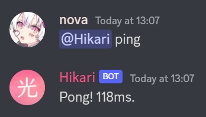

# Part 1 - Hikari Bot

First, grab your bot's token from the [Discord Developer Portal](https://discord.com/developers/applications) (refer to [Make your Discord Bot Application](intro.md#make-your-discord-bot-application)) and put it in the `.env` file, like so:

```bash
BOT_TOKEN=your_bot_token
```

Next, in `bot.py` paste the following:

```{code-block} python
:linenos:

import os

import dotenv
import hikari

dotenv.load_dotenv()

bot = hikari.GatewayBot(
    os.environ["BOT_TOKEN"],
    intents=hikari.Intents.ALL_MESSAGES,
)


@bot.listen()
async def on_message_create(event: hikari.GuildMessageCreateEvent) -> None:
    if not event.is_human or not event.content:
        return

    me = bot.get_me()
    if not me:
        return

    if event.content == f"<@{me.id}> ping":
        await event.message.respond(f"Pong! {bot.heartbeat_latency * 1000:.0f}ms.")


if __name__ == "__main__":
    bot.run()
```

Now save `bot.py` and run it:

```bash
python bot.py
```

You should see an output similar to this:

```
  oooo         o8o  oooo                            o8o       光 2.0.0.dev113 [148b5790]
  `888         `"'  `888                            `"'       © 2021-present, davfsa - MIT license
   888 .oo.   oooo   888  oooo   .oooo.   oooo d8b oooo       interpreter:   CPython 3.10.8
   888P"Y88b  `888   888 .8P'   `P  )88b  `888""8P `888       running on:    AMD64 Windows 10
   888   888   888   888888.     .oP"888   888      888       installed at:  C:\Users\nova\Documents\my_bot\.venv\lib\site-packages\hikari
   888   888   888   888 `88b.  d8(  888   888      888       documentation: https://docs.hikari-py.dev/en/2.0.0.dev113
  o888o o888o o888o o888o o888o `Y888""8o d888b    o888o      support:       https://discord.gg/Jx4cNGG

I 2022-12-24 12:56:01,835 hikari.bot: you can start 999 sessions before the next window which starts at 2022-12-25 12:55:43.396863+00:00; planning to start 1 session... 
I 2022-12-24 12:56:02,244 hikari.gateway.0: shard is ready: 2 guilds, Hikari#1093 (1007678609466601492), session 'd31f230cfba4228ba81b23ab3130b623' on v10 gateway
I 2022-12-24 12:56:02,809 hikari.bot: started successfully in approx 1.28 seconds
```

Now go into the server you invited your bot to, and send `@bot ping`, replacing `bot` with
your bot's username.

The bot should respond with `Pong!` and it's heartbeat latency:



**Congratulations, you've just run your first Hikari bot!**

Now let's go through what everything does

- **Line 1-4** - Import the `os`, `dotenv` and `hikari` modules
- **Line 6** - Load the `.env` file
- **Line 8-11** - Create a bot using the loaded token and `ALL_MESSAGES` (DM & guild) [intents](https://discord.com/developers/docs/topics/gateway#gateway-intents)  
    [Read the docs - Intents](https://hikari-lightbulb.readthedocs.io/en/latest/hikari_basics/intents.html)
- **Line 14-17** - The bot listens for messages sent in both guilds and DMs
    - If the message author is not a human or the message has no text content (or the bot doesn't have the `MESSAGE_CONTENT` intent and can't read it), the bot ignores it
- **Line 19-21** - Get the bot's Discord user
    - This should be available once the bot has fired hikari.StartingEvent, but not before that
- **Line 23-24** - If the message content is `<@bot_id> ping` (`@bot ping` in the Discord UI), the bot responds with `Pong!` and it's heartbeat latency
- **Line 27-28** - Run the bot!

To shut down the bot, use `CTRL`+`C` in the terminal. Hikari should log a few more lines, then exit:

```
I 2022-12-24 13:02:25,692 hikari.bot: bot requested to shut down
I 2022-12-24 13:02:25,692 hikari.gateway.0: shard has been requested to shutdown
I 2022-12-24 13:02:26,064 hikari.gateway.0: shard shutdown successfully
I 2022-12-24 13:02:26,064 hikari.bot: bot shut down successfully
I 2022-12-24 13:02:26,064 hikari.bot: successfully terminated
```

This bot works, but to add more commands (and slash commands) other than `ping` would be a *huge* hassle, so this is where Lightbulb comes in...

```{note}
Demo of hikari-only slash commands and REST bot coming soon!
```
