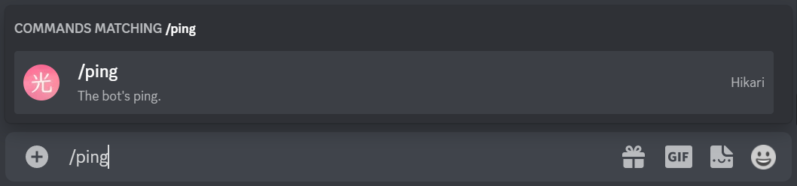
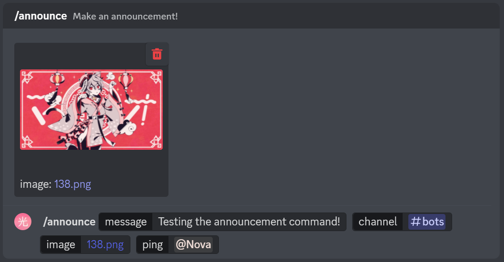
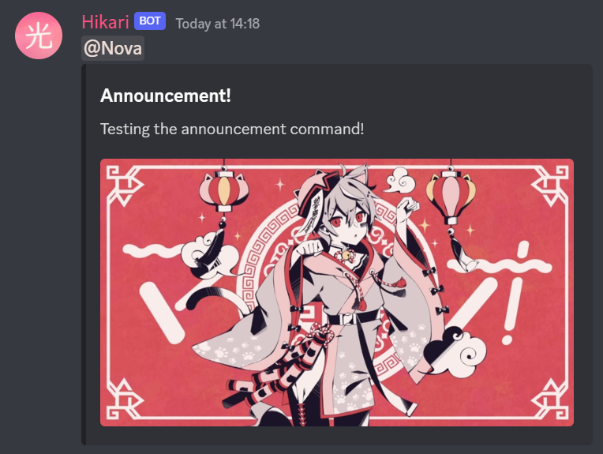
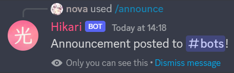

# Part 2 - Lightbulb Bot

Lightbulb is a command handler for Hikari, making it easy to create commands.

So to start using Lightbulb, let's change our `bot.py` a little (new code has been highlighted):

```{code-block} python
:linenos:
:emphasize-lines: 2, 6-7, 11, 13-17, 20-24

import os
from typing import Optional

import dotenv
import hikari
import lightbulb
from hikari import Intents

dotenv.load_dotenv()

INTENTS = Intents.GUILD_MEMBERS | Intents.GUILDS

bot = lightbulb.BotApp(
    os.environ["BOT_TOKEN"],
    intents=INTENTS,
    banner=None,
)


@bot.command
@lightbulb.command("ping", description="The bot's ping.")
@lightbulb.implements(lightbulb.SlashCommand)
async def ping(ctx: lightbulb.SlashContext) -> None:
    await ctx.respond(f"Pong! Latency: {bot.heartbeat_latency * 1000:.2f}ms.")


if __name__ == "__main__":
    bot.run()
```

- **Line 2 & 6-7** - Import [Optional](https://docs.python.org/3/library/typing.html#typing.Optional) from typing, lightbulb, and Intents from hikari
- **Line 11** - Set up the intents we want to use  
    [Read the docs - Intents](https://hikari-lightbulb.readthedocs.io/en/latest/hikari_basics/intents.html)
- **Line 13-17** - Use lightbulb to create the bot now,
    - passing our bot's token as before
    - changing the `intents` kwarg to use our new set of intents
    - adding a `banner` kwarg set to `None`, disabling the hikari banner shown when the bot starts  
        - *This isn't necessary, but the banner can get a little annoying after a while (sorry dav >\_>)*
- **Line 20-24** - Create a **slash command** with lightbulb named `ping` which works the same as the old `ping` command, responding with `Pong!` and the bot's heartbeat latency

```{note}
The `GUILD_MEMBERS` intent *must* be enable on the developer portal for your bot to use them.
```

Now let's run the bot again!

You should see a slightly different output this time:

```
I 2022-12-24 13:24:37,209 hikari.bot: you can start 998 sessions before the next window which starts at 2022-12-25 12:55:43.325554+00:00; planning to start 1 session... 
I 2022-12-24 13:24:37,808 hikari.gateway.0: shard is ready: 2 guilds, Hikari#1093 (1007678609466601492), session '9432e40babfaa02547b09cf16b23ac98' on v10 gateway
I 2022-12-24 13:24:38,216 lightbulb.internal: Processing guild application commands
I 2022-12-24 13:24:38,216 lightbulb.internal: Processing global application commands
I 2022-12-24 13:24:38,567 lightbulb.internal: Application command processing completed
I 2022-12-24 13:24:38,567 hikari.bot: started successfully in approx 1.78 seconds
```

Trying to run `@bot ping` will no longer work, as we've removed the code for that. However, you now have the slash command `/ping`!

Try typing `/ping`. A command should appear, with your bot's avatar next to it:



Hit enter, and let's run this new command!


We've just made a slash command! By passing `lightbulb.SlashCommand` to the `@lightbulb.implements` decorator, lightbulb will turn the command into a slash command.

## Command Options

Slash Commands can have options, and Discord supports quite a few different [options types](https://discord.com/developers/docs/interactions/application-commands#application-command-object-application-command-option-type).

[Read the docs - Command Option Types](https://hikari-lightbulb.readthedocs.io/en/latest/guides/commands.html#converters-and-slash-command-option-types)

Let's make a new slash command using some of these option types to demonstrate them!

After your `ping` command, add this:

```{code-block} python
:linenos:

@bot.command
@lightbulb.option(
    "ping", "Role to ping with announcement.", type=hikari.Role, required=False
)
@lightbulb.option(
    "image", "Announcement attachment.", type=hikari.Attachment, required=False
)
@lightbulb.option(
    "channel", "Channel to post announcement to.", type=hikari.TextableChannel
)
@lightbulb.option("message", "The message to announce.", type=str)
@lightbulb.command("announce", "Make an announcement!", pass_options=True)
@lightbulb.implements(lightbulb.SlashCommand)
async def announce(
    ctx: lightbulb.SlashContext,
    message: str,
    channel: hikari.GuildTextChannel,
    image: Optional[hikari.Attachment] = None,
    ping: Optional[hikari.Role] = None,
) -> None:
    embed = hikari.Embed(
        title="Announcement!",
        description=message,
    )
    embed.set_image(image)

    await ctx.app.rest.create_message(
        channel=channel.id,
        content=ping.mention if ping else hikari.UNDEFINED,
        embed=embed,
        role_mentions=True,
    )

    await ctx.respond(
        f"Announcement posted to <#{channel.id}>!", flags=hikari.MessageFlag.EPHEMERAL
    )
```

- **Line 2-11** - Specify the options for our command
    - We've specified a type for each option, such as `hikari.Role`, `hikari.Attachment` and `hikari.TextableChannel`
    - Using built-in Python types such as `str` and `int` is also valid (**Line 11**)
- **Line 16-19** - Pass the options as parameters to the command's function.
    - You *must* specify `pass_options=True` in the command decorator (**Line 12**) when passing the options as function parameters, or else lightbulb will error when attempting to run your command.
    ```{warning}
    The parameters must be named **exactly** as the options. You **cannot**, for example, name your `message` parameter "`msg`". Lightbulb will error if you do so.
    ```
- **Line 21-25** - Create an embed, setting its description and image to the message and attachment the command author provided  
    We'll look at embeds in more detail in the [next part](part_3.md)
- **Line 27-32** - Send the message to the given channel, pinging the role (if provided in the command options)
    ```{note}
    To ping everyone with the role, you must have set `role_mentions` to `True`, and the bot must have the `Mention All Roles` permission in the guild
    ```
- **Line 34-36** - Respond to the interaction with an `ephemeral` message, stating where the announcement has been posted

[Read the docs - Commands](https://hikari-lightbulb.readthedocs.io/en/latest/guides/commands.html)




