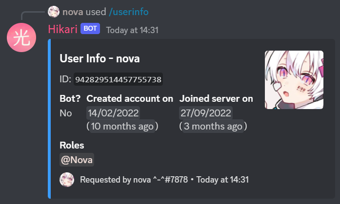
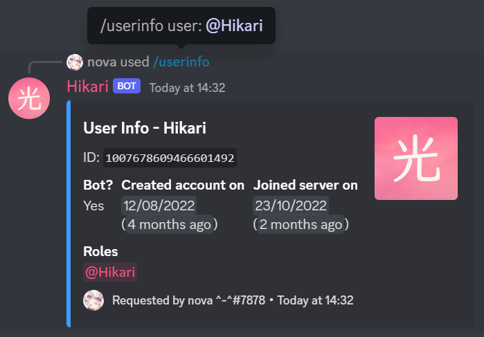

# Part 3 - Making a lightbulb extension

Extensions are a useful way to separate parts of your bot into different files, making it easier to manage.

So, let's create an extension!

In your `my_bot` folder make a new folder named `extensions`.

Then in that folder create a file named `info.py`.

Your file structure should look like this now:

```
my_bot
├─ bot.py
├─ requirements.txt
├─ .env
│
└─ extensions
   ├─ info.py
```

In `info.py` paste the following:

```{code-block} python
:linenos: true

from datetime import datetime
from typing import Optional

import hikari
import lightbulb

info_plugin = lightbulb.Plugin("Info")


@info_plugin.command
@lightbulb.app_command_permissions(dm_enabled=False)
@lightbulb.option(
    "user", "The user to get information about.", hikari.User, required=False
)
@lightbulb.command("userinfo", "Get info on a server member.", pass_options=True)
@lightbulb.implements(lightbulb.SlashCommand)
async def userinfo(
    ctx: lightbulb.SlashContext, user: Optional[hikari.User] = None
) -> None:
    assert ctx.guild_id is not None

    user = user or ctx.author
    user = ctx.bot.cache.get_member(ctx.guild_id, user)

    if not user:
        await ctx.respond("That user is not in this server.")
        return

    created_at = int(user.created_at.timestamp())
    joined_at = int(user.joined_at.timestamp())

    roles = [f"<@&{role}>" for role in user.role_ids if role != ctx.guild_id]

    embed = (
        hikari.Embed(
            title=f"User Info - {user.display_name}",
            description=f"ID: `{user.id}`",
            colour=0x3B9DFF,
            timestamp=datetime.now().astimezone(),
        )
        .set_footer(
            text=f"Requested by {ctx.author}",
            icon=ctx.author.display_avatar_url,
        )
        .set_thumbnail(user.avatar_url)
        .add_field(
            "Bot?",
            "Yes" if user.is_bot else "No",
            inline=True,
        )
        .add_field(
            "Created account on",
            f"<t:{created_at}:d>\n(<t:{created_at}:R>)",
            inline=True,
        )
        .add_field(
            "Joined server on",
            f"<t:{joined_at}:d>\n(<t:{joined_at}:R>)",
            inline=True,
        )
        .add_field(
            "Roles",
            ", ".join(roles) if roles else "No roles",
            inline=False,
        )
    )

    await ctx.respond(embed)


def load(bot: lightbulb.BotApp) -> None:
    bot.add_plugin(info_plugin)
```

And in `bot.py` we'll need to make a little change. On line 18, add:

```{code-block} python
bot.load_extensions_from("./extensions/")
```

So, now let's run the bot with our new `/userinfo` command!

You should see a new line in your output:

```
I 2022-12-24 13:24:36,782 lightbulb.app: Extension loaded 'extensions.info'
```

Now let's go and try out the command:




Now to go through what everything does...

- **Line 7** - Create a plugin named `Info` which will be used to add our new command  
    [Read the docs - Plugins](https://hikari-lightbulb.readthedocs.io/en/latest/guides/plugins.html)
- **Line 10** - Decorator to attach the following command to the plugin
- **Line 11** - Add some permissions to the command, disabling it from being accessible in DMs (we only want it to be run in servers)
- **Line 12-14** - Add a command option named "`user`" with a type of `hikari.User` that is **not required** and a description of "`The user to get information about.`"  
    [Read the docs - Converters and Slash Command Options Types](https://hikari-lightbulb.readthedocs.io/en/latest/guides/commands.html#converters-and-slash-command-option-types)
- **Line 15** - Decorator to create the command, setting the name to "`userinfo`" and the description to "`Get info on a server member.`"
- **Line 16** - Converts the decorated function into a slash command
- **Line 17-19** - The command's function, which takes the parameters `ctx` and the option `user`  
    [Read the docs - lightbulb.Context](https://hikari-lightbulb.readthedocs.io/en/latest/api_references/context.html)  
    [Read the docs - hikari.User](https://www.hikari-py.dev/hikari/users.html#hikari.users.User)
- **Line 20** - Assert that `ctx.guild_id` is not `None`, because it never will be
- **Line 22** - If a user was not passed as an option (`user` will be `None`), we assign `ctx.author` to `user`
- **Line 23** - Get the `Member` object for that user from the bot's cache  
    ```{note}
    This will return `None` if the user is not in the guild
    ```
- **Line 29-30** - Get the [UNIX Timestamps](https://www.unixtimestamp.com/) for when the member created their account and joined the guild
    ```{note}
    The rounding with `int()` is necessary, as Discord timestamps only work with integers, not floats
    ```
- **Line 32** - Get the member's list of roles, excluding `@everyone` (the `@everyone` role's ID is the guild's ID), and format it into a list of role mentions
- **Line 35-40** - Make a Discord [embed](https://www.hikari-py.dev/hikari/embeds.html#hikari.embeds.Embed) setting the title, description, colour and timestamp
- **Line 41-45** - Set the embed's [footer](https://www.hikari-py.dev/hikari/embeds.html#hikari.embeds.Embed.set_footer) and [thumbnail](https://www.hikari-py.dev/hikari/embeds.html#hikari.embeds.Embed.set_footer)
- **Line 46-65** - Add [fields](https://www.hikari-py.dev/hikari/embeds.html#hikari.embeds.Embed.add_field) to the embed, stating: 
    - whether the user is a bot or not
    - when their account was created & when they joined the server, using [Discord Timestamps](https://discord.com/developers/docs/reference#message-formatting-timestamp-styles)
    - a list of roles the member has
- **Line 68** - Respond to the interaction with the embed ([Read the docs - Context.respond](https://hikari-lightbulb.readthedocs.io/en/latest/api_references/context.html#lightbulb.context.base.ApplicationContext.respond))
- **Line 71-72** - The load function, to load the extension when the bot starts
    ```{note}
    This load function is required in *each* extension
    ```
    [Read the docs - Extensions](https://hikari-lightbulb.readthedocs.io/en/latest/guides/extensions.html)
