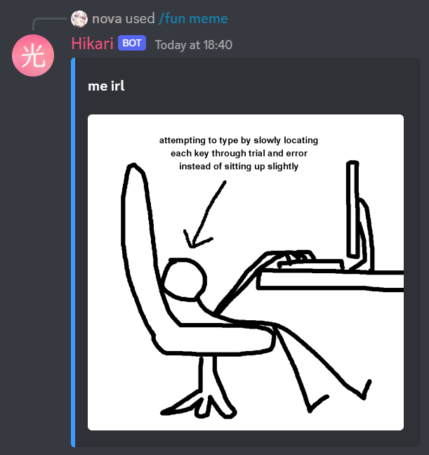
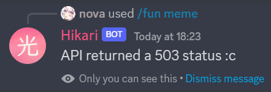

# Part 5 - Command Groups & Subcommands

Create a new file named `fun.py` in the extensions folder - this will contain our bot's second extension.

In `fun.py` paste the following:

```{code-block} python
:linenos:

import hikari
import lightbulb

fun_plugin = lightbulb.Plugin("Fun")


@fun_plugin.command
@lightbulb.command("fun", "All the entertainment commands you'll ever need!")
@lightbulb.implements(lightbulb.SlashCommandGroup)
async def fun_group(_) -> None:
    pass  # as slash commands cannot have their top-level command run, we simply pass here


@fun_group.child
@lightbulb.command("meme", "Get a meme!")
@lightbulb.implements(lightbulb.SlashSubCommand)
async def meme_subcommand(ctx: lightbulb.SlashContext) -> None:
    async with ctx.bot.d.client_session.get(
        "https://meme-api.herokuapp.com/gimme"
    ) as res:
        if not res.ok:
            await ctx.respond(
                f"API returned a {res.status} status :c",
                flags=hikari.MessageFlag.EPHEMERAL,
            )
            return

        data = await res.json()

        if data["nsfw"]:
            await ctx.respond(
                "Response was NSFW, couldn't send :c",
                flags=hikari.MessageFlag.EPHEMERAL,
            )
            return

        embed = hikari.Embed(colour=0x3B9DFF)
        embed.set_author(name=data["title"], url=data["postLink"])
        embed.set_image(data["url"])

        await ctx.respond(embed)

def load(bot: lightbulb.BotApp) -> None:
    bot.add_plugin(fun_plugin)
```

- **Line 4** - Create a new plugin named `Fun`
- **Line 7** - Decorator to attach the following command to the plugin
- **Line 8** - Decorator to create the command, setting the name to "`fun`" and adding a description
- **Line 9** - Convert the decorated function into a SlashCommandGroup
- **Line 10** - The command's function
- **Line 11** - `pass` the function, as slash commands cannot have their top-level command run
- **Line 14** - attach the decorated function to the `fun_group` command group
- **Line 15** - Decorator to create the subcommand, setting the name to `meme` and adding a description
- **Line 16** - Convert the decorated function into a `SlashSubCommand`
- **Line 17** - The subcommand's function
- **Line 18-21** - Using the `client_session` from the `bot.d` data store that we created in the previous section, get a meme from the [Meme API](https://github.com/D3vd/Meme_Api)   
    [Read the docs - aiohttp.ClientSession](https://docs.aiohttp.org/en/stable/#client-example)
- **Line 21-26** - If the response returned status code that wasn't "ok",
    - Respond with a helpful ephemeral message to the command author
    - `return` so that no further code in the function is run
- **Line 28** - The response is ok, get the json from it
- **Line 30-25** - If the response is NSFW (Not Safe For Work), we don't want to send it.
    - Again, we send an ephemeral message to the command author and `return` so no further code is run
- **Line 37-42** - If the response is ok and the meme is not NSFW, then
    - **Line 37** - Create an embed
    - **Line 38** - Set the embed's author to the meme's title and link
    - **Line 39** - Set the embed's image to the meme's image url
    - **Line 41** - Respond to the interaction with the embed

```{note}
Using the [Meme API Documentation](https://github.com/D3vd/Meme_Api), you could change the command to make it your own.

For example:
- Add an option to choose which subreddit to get the meme from
- Make a `/bulk-meme` command which fetches multiple memes in one go
```

Now, let's test it!



and if we can't fetch a meme:


